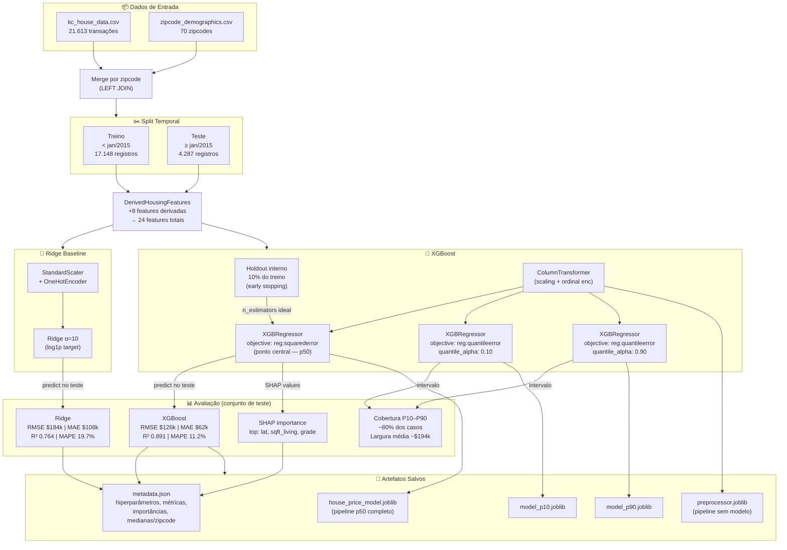

# Diagrama: Pipeline de Machine Learning

## Objetivo

Mostrar o pipeline completo de treinamento — desde os dados brutos até os artefatos salvos em `artifacts/model/`. O diagrama deixa visíveis as decisões de design: split temporal, treinamento paralelo de três modelos (p50, p10, p90), avaliação separada de baseline vs modelo final, e o que é salvo ao final.

## Blocos

| Bloco | Papel |
|---|---|
| **Dados brutos** | `kc_house_data.csv` + `zipcode_demographics.csv` — carregados e mergeados por zipcode |
| **Split temporal** | Cutoff jan/2015: treino = passado, teste = futuro — simula inferência real |
| **Feature Engineering** | `DerivedHousingFeatures` — cria 8 features derivadas sobre as 16 originais |
| **Preprocessador Ridge** | StandardScaler + OneHotEncoder para o baseline linear |
| **Preprocessador XGBoost** | ColumnTransformer com scaling e ordinal encoding |
| **Ridge baseline** | Regressão linear com L2 — referência de performance |
| **Holdout interno** | 10% do treino separado para early stopping do XGBoost |
| **XGBoost p50** | Modelo principal — previsão de ponto central |
| **XGBoost p10 / p90** | Quantile regression — limites do intervalo de confiança |
| **Avaliação** | Métricas em escala de dólares para baseline e XGBoost final |
| **SHAP** | Importâncias por valor SHAP no conjunto de teste |
| **Artefatos salvos** | model.joblib, preprocessor.joblib, metadata.json |

---

## Diagrama Mermaid

---

## Notas de Leitura

- O `DerivedHousingFeatures` é um `TransformerMixin` do scikit-learn — roda o mesmo código em treino e inferência, sem risco de divergir
- O early stopping usa RMSE em log-scale no holdout para determinar `n_estimators` ideal (cap: 600)
- Os três modelos XGBoost (p50, p10, p90) compartilham os mesmos hiperparâmetros base — só o `objective` e `quantile_alpha` diferem
- O `preprocessor.joblib` é salvo separado do modelo porque é necessário para extrair a matrix de features para cálculo de SHAP na inferência
- Toda a lógica está em `app/ml/train.py`; pode ser reproduzida com `make train`
