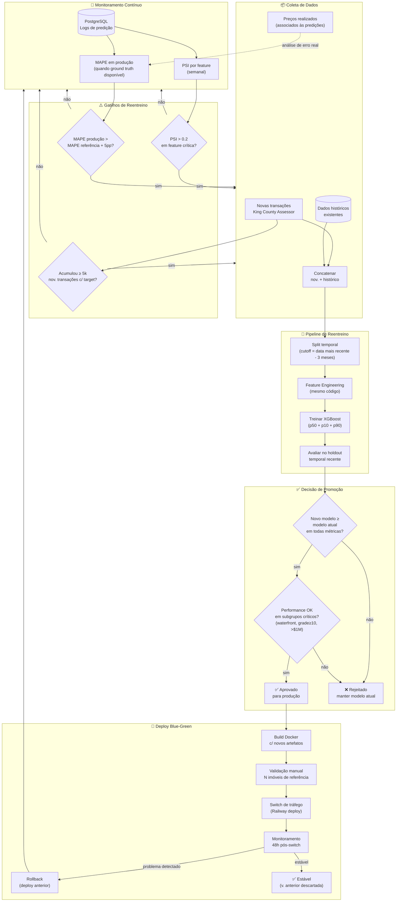

# Diagrama: Fluxo de Reentreino

## Objetivo

Mostrar como o sistema evoluiria para incorporar novos dados e manter o modelo relevante ao longo do tempo. O diagrama cobre as três fases do ciclo de vida: detecção de que o reentreino é necessário, execução do pipeline de treinamento, e promoção segura do novo modelo para produção com critérios claros de aceite e rollback.

## Blocos

| Bloco | Papel |
|---|---|
| **Monitoramento contínuo** | Análise periódica da distribuição de features (PSI) e métricas de performance (MAPE) |
| **Gatilhos** | Condições quantitativas que acionam o pipeline de reentreino |
| **Coleta de dados** | Download incremental de novas transações + ground truth de preços realizados |
| **Pipeline de treino** | Mesmo pipeline do treino original — dados novos + histórico |
| **Avaliação do candidato** | Métricas do novo modelo comparadas com o modelo em produção |
| **Critérios de promoção** | Thresholds quantitativos + verificação em subgrupos críticos |
| **Deploy blue-green** | Switch de tráfego com fallback seguro para versão anterior |
| **Monitoramento pós-deploy** | Acompanhamento por 30 dias após a promoção |

---

## Diagrama Mermaid

---

## Notas de Leitura

- O ciclo de monitoramento é contínuo — os gatilhos verificam condições, não calendário
- A seta tracejada de `GroundTruth` para `MAPE_Prod` indica que o loop de avaliação real só é possível quando preços realizados estão disponíveis
- "Subgrupos críticos" são imóveis waterfront, grade ≥ 10 e preço > $1M — segmentos com poucos dados de treino e maior risco de regressão
- O rollback no Railway é feito via interface de deployments — qualquer build anterior pode ser restaurado em < 2 minutos
- Documentação detalhada: [`docs/4-aprendizado-continuo.md`](../docs/4-aprendizado-continuo.md)
