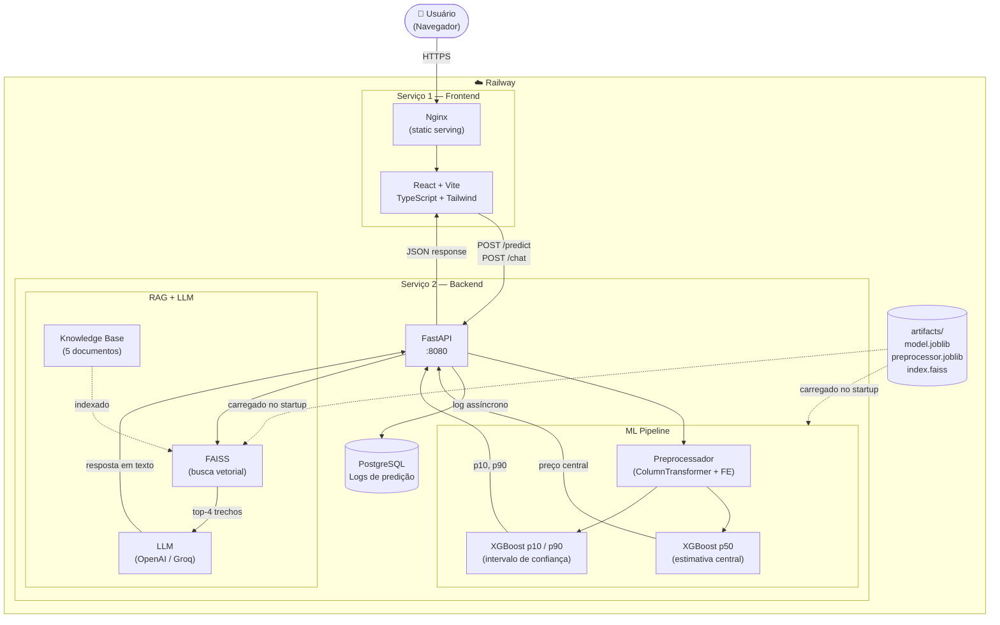

# Diagrama: Arquitetura da Solução

## Objetivo

Mostrar como os componentes da solução se conectam em produção — do navegador do usuário até o modelo de ML e o banco de dados. O diagrama deixa claro que há dois serviços independentes (frontend e backend) e que o modelo XGBoost é o núcleo da inferência, com o RAG e o LLM como camadas complementares.

## Blocos

| Bloco | Papel |
|---|---|
| **Usuário** | Acessa a aplicação pelo navegador |
| **Frontend (React + Nginx)** | Interface estática servida pelo Railway; se comunica com a API via `VITE_API_BASE_URL` |
| **API (FastAPI)** | Ponto central de processamento; recebe requisições de previsão e chat |
| **ML Pipeline** | XGBoost p50 + quantile p10/p90; retorna estimativa e intervalo |
| **RAG** | Busca vetorial no FAISS; recupera contexto da knowledge base |
| **LLM** | Gera resposta em linguagem natural usando contexto recuperado + resultado do ML |
| **PostgreSQL** | Persiste logs de predição para monitoramento e análise |
| **Artifacts** | Arquivos .joblib (modelo + preprocessador) e index.faiss embutidos na imagem Docker |

---

## Diagrama Mermaid

---

## Notas de Leitura

- As setas tracejadas (`-.->`) indicam carregamento no startup, não fluxo de requisição
- O `Artifacts` é gerado no build Docker e embutido na imagem — não depende de volume externo
- O PostgreSQL é opcional; a API funciona sem ele (predições não são persistidas)
- O LLM só é acionado em chamadas ao `/chat` — o `/predict` não passa pelo LLM
