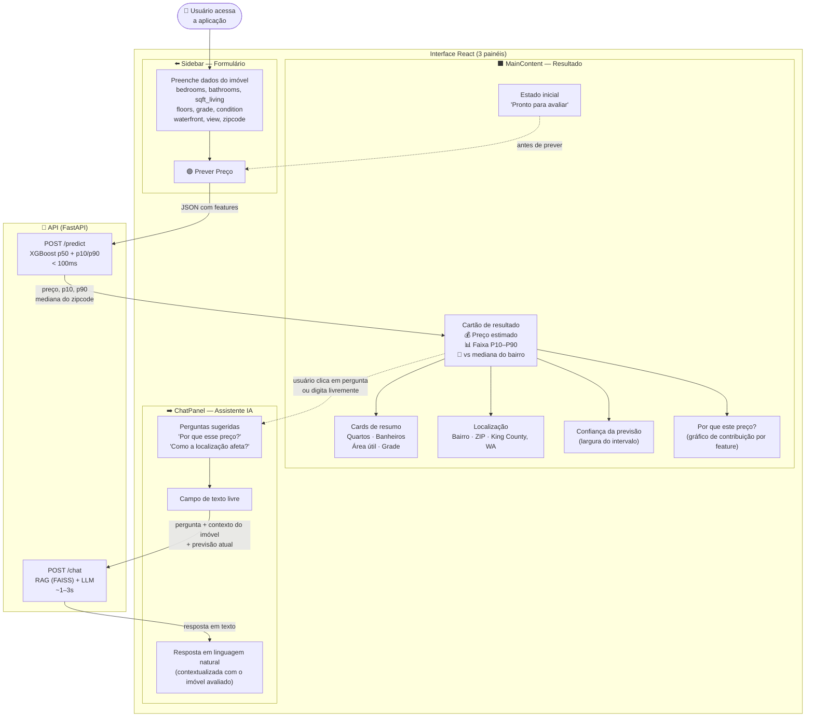
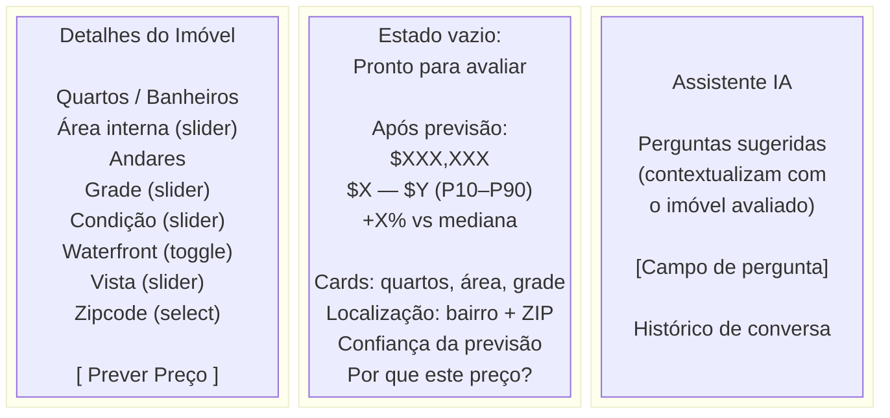
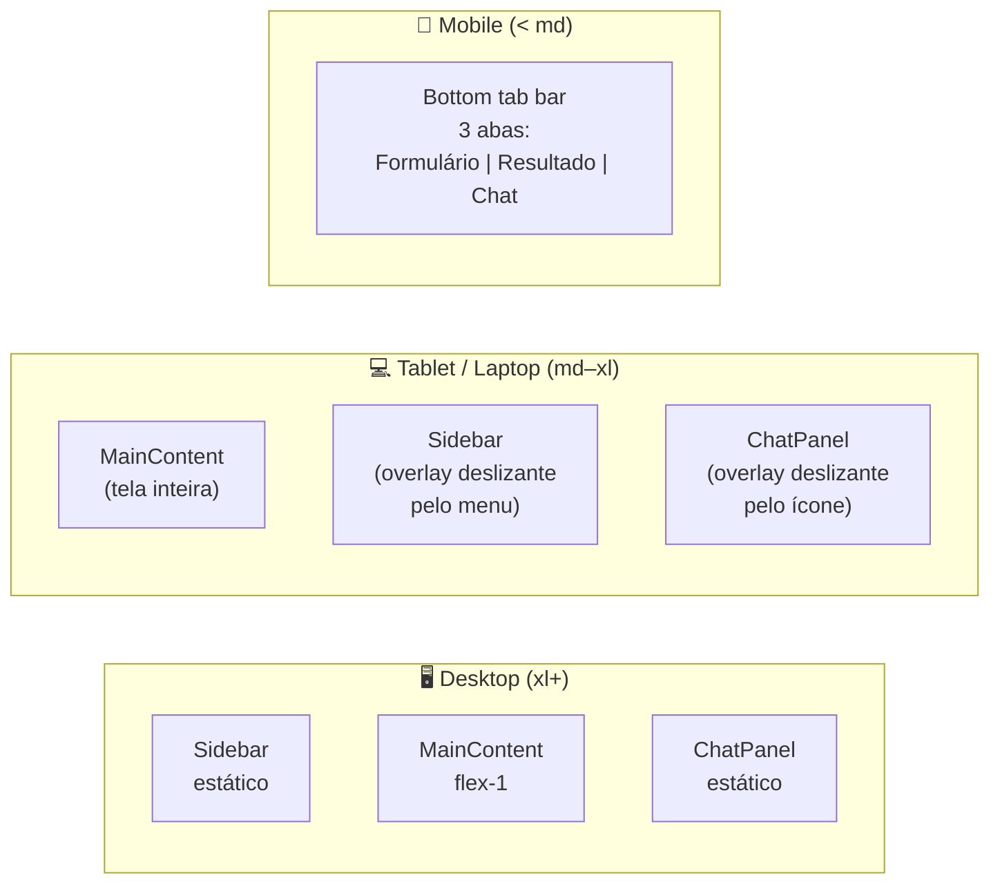

# Diagrama: Visão Geral da Interface

## Objetivo

Mostrar o fluxo do usuário na aplicação — desde a entrada dos dados até a interpretação do resultado — e como os três painéis da interface (formulário, resultado, chat) se relacionam. O diagrama deixa claro em qual momento cada camada da solução é acionada.

## Blocos

| Bloco | Papel |
|---|---|
| **Sidebar (formulário)** | Painel esquerdo com controles de entrada: quartos, banheiros, área, andares, grade, condição, waterfront, vista, zipcode |
| **Botão "Prever Preço"** | Aciona o POST /predict — único ponto de entrada para o modelo ML |
| **MainContent (resultado)** | Painel central com estimativa, intervalo P10–P90, comparação com mediana do bairro, cards de features, localização |
| **ChatPanel (assistente)** | Painel direito com chat conversacional; acionado pelo usuário para explicações |
| **POST /predict** | API retorna preço central, p10, p90, mediana do zipcode |
| **POST /chat** | API usa RAG + LLM para responder perguntas contextualizadas |

---

## Diagrama Mermaid — Fluxo do Usuário

---

## Diagrama Mermaid — Layout da Interface (desktop)

---

## Responsividade

A interface adapta os 3 painéis conforme o tamanho da tela:

---

## Notas de Leitura

- O `POST /predict` é acionado **apenas** pelo botão "Prever Preço" — não há auto-predict ao alterar sliders (evita chamadas desnecessárias à API)
- O `POST /chat` carrega automaticamente o contexto do imóvel avaliado + a previsão atual — o usuário não precisa repassar os dados manualmente no chat
- As perguntas sugeridas no chat mudam conforme o estado: antes de prever (perguntas sobre o mercado), depois de prever (perguntas sobre o resultado específico)
- O toggle "Mostrar R$" converte os valores de US$ para BRL com câmbio aproximado — é uma referência de contexto, não dado financeiro oficial
