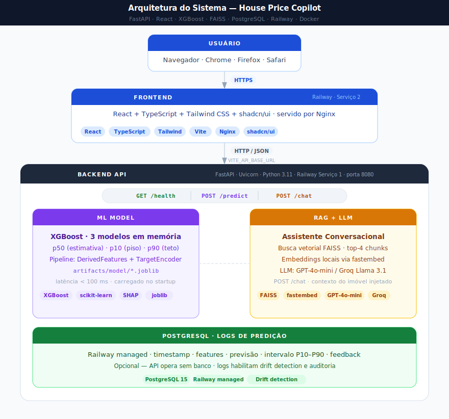

# Estratégia de Deploy

---

## 1. Visão Geral

Este documento está dividido em duas partes:

**Parte A — Deploy atual (Railway):** a solução em produção, construída para demonstrar que o sistema funciona end-to-end em ambiente real com CI/CD básico e zero custo operacional.

**Parte B — Deploy profissional em empresa:** a arquitetura que seria adotada num contexto de produto real com SLA, time de ML, múltiplos modelos em paralelo e necessidade de rollback controlado.

A distinção é intencional: o Railway resolve o problema de ter algo funcionando em produção agora; a arquitetura enterprise resolve os problemas que aparecem quando o sistema precisa ser mantido, monitorado e evoluído por um time.

---

# Parte A — Deploy Atual (Railway)

## A.1 Arquitetura do Sistema em Produção

A solução em produção é composta por dois serviços independentes hospedados no Railway, conectados por uma API REST:



> Fonte editável: [`diagrams/01-system-architecture.excalidraw`](diagrams/01-system-architecture.excalidraw)

Os dois serviços são deployados e escalados de forma independente. O frontend é um build estático servido por Nginx — não tem lógica de servidor além de roteamento SPA. Toda a computação ocorre na API.

## A.2 Componentes

### Frontend (React + Vite + Nginx)

**Stack:** React, TypeScript, Tailwind, shadcn/ui  
**Diretório:** `frontend/`

O frontend é compilado em tempo de build com `npm run build`, gerando um bundle estático em `dist/`. O Nginx serve os arquivos e faz fallback para `index.html` (SPA routing).

A URL da API é injetada em tempo de build via variável de ambiente:

```
VITE_API_BASE_URL=https://sua-api.up.railway.app
```

Esta variável precisa estar marcada como "Available at Build Time" no Railway — diferente de variáveis de runtime, o Vite a incorpora diretamente no bundle JavaScript.

### API (FastAPI + Uvicorn)

**Stack:** Python 3.11, FastAPI, Uvicorn  
**Diretório:** raiz do repositório

| Rota | Método | Descrição |
|---|---|---|
| `/health` | GET | Status: modelo, vectorstore, LLM, banco |
| `/predict` | POST | Características do imóvel → previsão + intervalo P10–P90 |
| `/chat` | POST | Pergunta + contexto do imóvel → resposta do LLM via RAG |

O startup verifica automaticamente todos os componentes. Serviços ausentes (banco offline, chave LLM ausente) não travam o startup — a API sobe em modo degradado e reporta o estado via `/health`.

### Modelo ML (XGBoost + preprocessador)

O modelo está embutido na imagem Docker como arquivos `.joblib`:

- `artifacts/model/house_price_model.joblib` — pipeline completo (p50)
- `artifacts/model/preprocessor.joblib` — pipeline de pré-processamento isolado
- `artifacts/model/metadata.json` — métricas, hiperparâmetros, importâncias, medianas por zipcode
- `artifacts/model/model_p10.joblib` / `model_p90.joblib` — modelos quantílicos

Carregados uma vez no startup e mantidos em memória. Latência de inferência: < 100ms por requisição.

### Camada RAG

- `artifacts/vectorstore/index.faiss` — índice FAISS com embeddings da knowledge base
- `data/knowledge_base/` — documentos fonte (markdown + CSV)

O retriever busca os 4 trechos mais relevantes por pergunta e os injeta no prompt do LLM. Embeddings locais via `fastembed` (sem custo) ou OpenAI, conforme configuração.

### Banco de Dados (PostgreSQL managed)

Opcional — a API funciona sem banco. Quando disponível, registra cada predição com timestamp, features de entrada, previsão e intervalo para análise de drift e uso.

## A.3 Docker e CI/CD no Railway

**Multi-stage build (API):**

```
Stage 1 — builder:
  instala dependências Python
  baixa dataset KC House (com fallback)
  executa python -m app.ml.train       (≈ 10–15 min)
  executa python -m app.rag.build_kb   (indexação FAISS)

Stage 2 — final:
  copia código + artefatos gerados (sem dados brutos)
  resultado: imagem enxuta pronta para deploy
```

O treino dentro do Docker garante que o modelo em produção foi treinado no mesmo ambiente em que será executado — sem divergências de versão de biblioteca.

**railway.toml (API):**

```toml
[build]
builder = "DOCKERFILE"
dockerfilePath = "Dockerfile"

[deploy]
healthcheckPath = "/health"
healthcheckTimeout = 120
restartPolicyType = "ON_FAILURE"
restartPolicyMaxRetries = 5
```

O `healthcheckTimeout = 120s` acomoda o carregamento dos artefatos na memória durante o startup.

## A.4 Variáveis de Ambiente

| Variável | Tipo | Obrigatória |
|---|---|---|
| `APP_ENV` | Runtime | Sim |
| `LLM_PROVIDER` | Runtime | Sim (`openai` ou `groq`) |
| `OPENAI_API_KEY` / `GROQ_API_KEY` | Runtime | Sim (conforme provider) |
| `DATABASE_URL` | Runtime | Não |
| `CORS_ORIGINS` | Runtime | Recomendado em produção |
| `VITE_API_BASE_URL` | Build time (frontend) | Sim |

---

# Parte B — Deploy Profissional em Empresa

O Railway resolve bem os problemas de escala inicial e demo. A partir do momento em que o sistema entra em produção real — com SLA, múltiplos usuários, time de ML e necessidade de evoluir o modelo sem downtime — a arquitetura precisa ser repensada em cinco pilares:

1. **Infraestrutura e orquestração**
2. **CI/CD com múltiplos ambientes**
3. **Ciclo de vida do modelo (MLOps)**
4. **Observabilidade**
5. **Segurança e governança**

---

## B.1 Infraestrutura e Orquestração

### Comparação de opções

| Plataforma | Quando usar | Trade-off |
|---|---|---|
| **AWS ECS + Fargate** | Time pequeno, sem expertise em Kubernetes, escala automática sem gerenciar nodes | Menos controle, mais caro em alta escala |
| **Kubernetes (EKS/GKE)** | Time com experiência em K8s, múltiplos serviços, precisa de controle fino de recursos | Curva de aprendizado alta, overhead de operação |
| **AWS Lambda + API Gateway** | Modelo leve, tráfego irregular, custo por invocação | Cold start pode ser problema; XGBoost com 3 modelos + FAISS não é ideal para Lambda |

**Escolha recomendada para este projeto em escala:** AWS ECS + Fargate com Application Load Balancer. O modelo XGBoost (3 pipelines) + FAISS tem footprint de memória (~300–500MB) que não é amigável para Lambda. ECS oferece autoscaling sem gerenciar a infraestrutura de nodes.

### Infraestrutura como Código (IaC)

Todo o ambiente seria definido em Terraform (ou Pulumi):

```
infra/
  modules/
    ecs-service/      → task definition, service, autoscaling
    rds/              → PostgreSQL managed
    s3-artifacts/     → bucket para artefatos de modelo
    ecr/              → registry de imagens Docker
    alb/              → load balancer + SSL termination
  envs/
    staging/          → variáveis do ambiente de homologação
    production/       → variáveis do ambiente de produção
```

Benefício: qualquer engenheiro pode reproduzir o ambiente completo com `terraform apply`. Sem configuração manual em console = sem configuração esquecida em documentação.

### Separação de responsabilidades

```
Usuário (HTTPS)
    ↓
CloudFront / CDN          → cache de assets estáticos do frontend
    ↓
Application Load Balancer → SSL termination, roteamento /api/* → API
    ↓
ECS Service (API)         → 2–N tasks, autoscaling por CPU/memória
    ↓
S3 (artefatos)            → modelo, preprocessador, FAISS index
RDS PostgreSQL            → logs de predição, feedback, drift metrics
```

O frontend seria deployado no S3 + CloudFront — sem Nginx gerenciado. A CDN serve o bundle com cache de borda e invalidação automática a cada deploy.

---

## B.2 CI/CD com Múltiplos Ambientes

### Fluxo de branches e ambientes

```
feature/* → PR → main → staging (automático) → production (aprovação manual)
```

| Branch | Ambiente | Deploy | Trigger |
|---|---|---|---|
| `feature/*` | — | Sem deploy, apenas testes | Push |
| `main` | **Staging** | Automático | Merge no main |
| Tag `v*` | **Production** | Manual (aprovação) | Tag semântica |

### Pipeline CI/CD (GitHub Actions)

```yaml
# Simplificado — fluxo real por etapa:

on_push_main:
  1. lint + type check (ruff, mypy)
  2. testes unitários (pytest)
  3. testes de integração (API contra modelo real)
  4. build Docker (multi-stage)
  5. push imagem para ECR (tag: git SHA)
  6. deploy no ECS staging (task definition atualizada)
  7. smoke test automatizado no staging (/health + /predict com fixture)
  8. notificação Slack: "staging atualizado — SHA abc1234"

on_tag_v*:
  1. aprovação manual no GitHub (environment protection)
  2. deploy no ECS production (mesma imagem do staging — sem rebuild)
  3. blue/green switch (ver seção B.3)
  4. smoke test em produção
  5. notificação: "produção atualizada — v1.2.0"
```

**Ponto crítico:** a imagem que vai para produção é **a mesma** que foi testada em staging. Sem rebuild em produção — isso elimina a classe de bugs onde o ambiente de staging e o de produção diferem.

### Separação entre treino e serving

No Railway, o modelo é treinado dentro do Docker no momento do build. Em produção profissional, treino e serving são pipelines separados:

```
Pipeline de Treino (Airflow / GitHub Actions agendado):
  Dados novos disponíveis?
    → Treinar novo modelo
    → Avaliar métricas vs. threshold mínimo
    → Se aprovado: salvar artefatos no S3 com versão
    → Registrar no MLflow (ou W&B)
    → Abrir PR ou notificar time

Pipeline de Serving (ECS):
  No startup: baixar artefato versionado aprovado do S3
  → Não treina, não acessa dados brutos
  → Apenas carrega e serve
```

Benefício: o serviço de serving escala para zero custo em tempo idle; o treino roda quando há dados novos, independente do serving.

---

## B.3 Ciclo de Vida do Modelo (MLOps)

### Model Registry

Cada versão de modelo registrada contém:

```json
{
  "version": "2026-04-14-v3",
  "trained_at": "2026-04-14T10:00:00Z",
  "git_sha": "abc1234",
  "dataset_version": "kc_house_2014_2015_v2",
  "metrics": {
    "test_mae": 62083,
    "test_rmse": 125845,
    "test_r2": 0.891,
    "coverage_p10_p90": 0.802
  },
  "approved_by": "ml-team",
  "promoted_to_prod": "2026-04-15T08:00:00Z",
  "artifacts_s3": "s3://company-ml-artifacts/house-price/v3/"
}
```

**Ferramentas:** MLflow (self-hosted ou Databricks Managed), Weights & Biases, ou tabela customizada no PostgreSQL para times menores.

O registry permite:
- Rollback para versão anterior em segundos (sem rebuild Docker)
- Comparação histórica de métricas entre versões
- Auditoria de quem aprovou qual versão e quando

### Blue/Green Deploy para modelos


> Fonte editável: [`diagrams/04-bluegreen-deploy.excalidraw`](diagrams/04-bluegreen-deploy.excalidraw)

O processo de substituição de modelo em produção sem downtime:

```
Estado inicial:
  ECS task "blue"  → modelo v2 (100% tráfego)
  ECS task "green" → inativa

Deploy de v3:
  1. Subir task "green" com modelo v3
  2. Health check do green (inclui smoke test de predição)
  3. ALB: mover 100% do tráfego para green
  4. Monitorar por 15 min (métricas de latência e erro)
  5a. Estável → desligar blue (v2 descartado)
  5b. Problema detectado → reverter ALB para blue (rollback < 30s)
```

Alternativa para times que querem mais segurança: **canary deploy** — enviar 5% do tráfego para o novo modelo primeiro, monitorar por 24h, e só então fazer o switch completo. Útil quando há dúvida sobre a qualidade do novo modelo em dados de produção reais.

### Reentreino Automatizado

```
Trigger options (escolher conforme maturidade do time):

Opção 1 — Agendado:
  Cron semanal → coleta dados novos → treina → avalia → registra

Opção 2 — Por volume de dados:
  Acumulou N novos registros? → aciona pipeline de treino

Opção 3 — Por drift detectado:
  PSI > threshold em alguma feature? → alerta + aciona treino
  KS-test detectou shift no target? → alerta + aciona treino
```

Para o contexto deste projeto, **Opção 1 (agendado mensal)** seria o ponto de partida — simples de implementar, auditável, sem risco de loops de reentreino por spike de dados.

---

## B.4 Observabilidade

### Stack recomendada

| Componente | Ferramenta | O que monitora |
|---|---|---|
| Métricas de infraestrutura | Prometheus + Grafana | CPU, memória, latência p50/p95/p99, throughput |
| Logs estruturados | ELK Stack ou CloudWatch | Logs da aplicação, erros, auditoria |
| Tracing distribuído | OpenTelemetry + Jaeger | Latência por etapa (feature eng → XGBoost → resposta) |
| Alertas | PagerDuty / Opsgenie | On-call para degradação de SLA |
| Drift de dados | custom ou Evidently AI | PSI das features de entrada vs. distribuição de treino |

### Métricas de negócio (específicas para ML)

Além das métricas de infraestrutura, um sistema de ML precisa monitorar a qualidade das previsões:

| Sinal | Cálculo | Threshold de alerta | Ação |
|---|---|---|---|
| **Data drift** | PSI das features numéricas vs. distribuição de treino | PSI > 0.2 em qualquer feature principal | Investigar + considerar reentreino |
| **Prediction drift** | KS-test da distribuição de previsões vs. baseline | p-value < 0.05 por 3 dias consecutivos | Alerta + análise do time |
| **Coverage P10–P90** | % dos casos onde preço real cai no intervalo (quando disponível) | Cobertura < 70% | Reentreino urgente |
| **Latência de inferência** | p95 do tempo de resposta do `/predict` | p95 > 500ms | Escalar ECS tasks |
| **Taxa de erro** | % de respostas 5xx | > 0.5% em janela de 5 min | PagerDuty (on-call) |
| **Requisições por minuto** | Throughput do endpoint `/predict` | < 10% da média histórica por > 30 min | Verificar problema upstream |

### Dashboard de saúde do modelo

Um dashboard dedicado (Grafana ou Metabase) exibiria em tempo real:
- Distribuição de previsões do dia vs. distribuição histórica
- Histograma de features de entrada mais usadas
- Taxa de uso do intervalo P10–P90 (usuários que consultam o chat após ver o intervalo largo)
- Erro real do modelo (quando preço de venda real é eventualmente conhecido)

---

## B.5 Segurança e Governança

### Gestão de segredos

**Nunca em variáveis de ambiente diretas em produção.** Fluxo seguro:

```
Secrets Manager (AWS Secrets Manager ou HashiCorp Vault)
  → IAM role atribuída à ECS task (sem credenciais hardcoded)
  → Task busca secrets no startup via SDK
  → Rotação automática de chaves sem deploy
```

Benefício: se uma task ECS for comprometida, o atacante não tem as credenciais no processo — elas são buscadas on-demand via IAM role que expira.

### Autenticação da API

O endpoint `/predict` em produção real precisaria de autenticação:

```
Opção A — API Key (simples, adequado para B2B):
  X-API-Key: <token>
  Validado via tabela no banco ou Redis

Opção B — JWT + OAuth (adequado para B2C / múltiplos usuários):
  Authorization: Bearer <jwt>
  Validado com biblioteca jose + provider (Auth0, Cognito, Keycloak)
```

Para o contexto atual (aplicação interna / demo), nenhuma autenticação é necessária. Para um produto público, autenticação é obrigatória antes de qualquer exposição real.

### Compliance e auditoria

- Todos os logs de predição retidos por X meses (conforme política de dados da empresa)
- PII: se features incluírem dados pessoais (nome, CPF, endereço), o pipeline precisa de anonimização antes de armazenar logs
- Model card: documentação pública das limitações, vieses conhecidos e métricas de fairness — especialmente importante se o modelo influenciar decisões de crédito ou aluguel

---

## B.6 Comparação: Railway (atual) vs. Empresa (target)

| Dimensão | Railway (demo) | Empresa (producão real) |
|---|---|---|
| **Infraestrutura** | PaaS gerenciado, zero config | IaC (Terraform), ECS/K8s |
| **CI/CD** | Deploy automático no push | Staging automático + produção com aprovação manual |
| **Treino** | Dentro do Docker, a cada build | Pipeline separado (Airflow), agendado ou por trigger |
| **Modelo** | Embutido na imagem Docker | Artefatos no S3, carregados no startup |
| **Versionamento** | Implícito na imagem Docker | Model registry (MLflow ou W&B) |
| **Rollback** | Redeploy da imagem anterior (minutos) | Rollback de artefato no S3 + restart (< 60s) |
| **Deploy de modelo** | Downtime mínimo no restart | Blue/green sem downtime |
| **Segredos** | Variáveis de ambiente no painel | AWS Secrets Manager + IAM roles |
| **Observabilidade** | Logs no painel do Railway | Prometheus + Grafana + alertas PagerDuty |
| **Drift** | Não monitorado | PSI por feature + KS-test no target |
| **Custo mensal** | US$ 0–20 (free tier) | US$ 200–2.000+ (depende de escala) |
| **Time necessário** | 1 pessoa | 1–2 MLEs + 1 DevOps/Platform |

---

## B.7 Fluxo de Reentreino Pipeline (visão completa)


> Fonte editável: [`diagrams/03-retraining-pipeline.excalidraw`](diagrams/03-retraining-pipeline.excalidraw)

O fluxo de reentreino completo em ambiente profissional:

```
1. Trigger (cron semanal ou drift detectado)
     ↓
2. Coleta de dados novos (S3 data lake ou data warehouse)
     ↓
3. Validação de qualidade dos dados (Great Expectations ou custom)
   - Schema correto?
   - Distribuição de features dentro do range histórico?
   - Volume mínimo de novos registros atingido?
     ↓ (falha → alerta, sem treino)
4. Treino do novo modelo (job ECS ou SageMaker Training Job)
     ↓
5. Avaliação automática vs. thresholds mínimos:
   - MAE < US$ 80.000 no holdout?
   - R² > 0.85?
   - Coverage P10–P90 > 75%?
     ↓ (falha → alerta, sem promoção)
6. Comparação vs. modelo em produção:
   - Novo modelo é ≥ 2% melhor em MAE?
     ↓ (não melhora → manter atual)
7. Registrar no model registry (MLflow)
     ↓
8. Notificação ao time para aprovação manual
     ↓
9. Deploy blue/green em staging
10. Aprovação manual (ou automática se todos os gates passaram)
11. Deploy blue/green em produção
12. Monitoramento por 48h
13. Confirmar ou rollback
```

A presença de gates automáticos em cada etapa garante que um modelo degradado **nunca** chegue a produção automaticamente — mesmo que o pipeline de treino seja totalmente automatizado.
