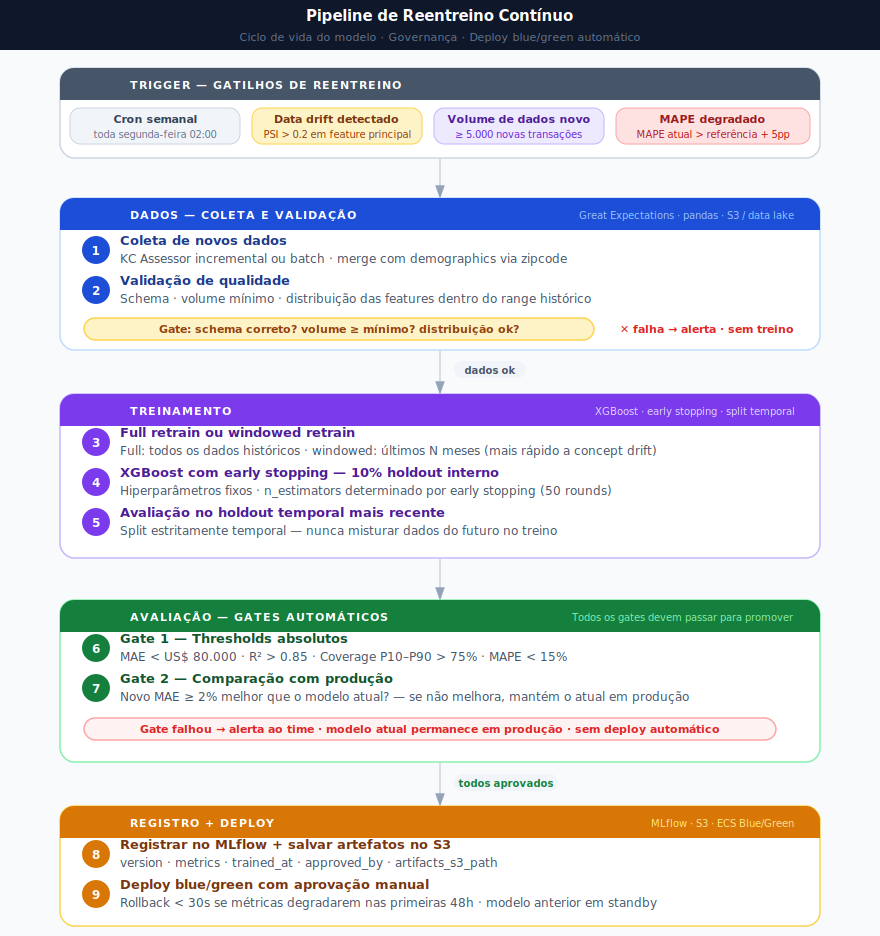
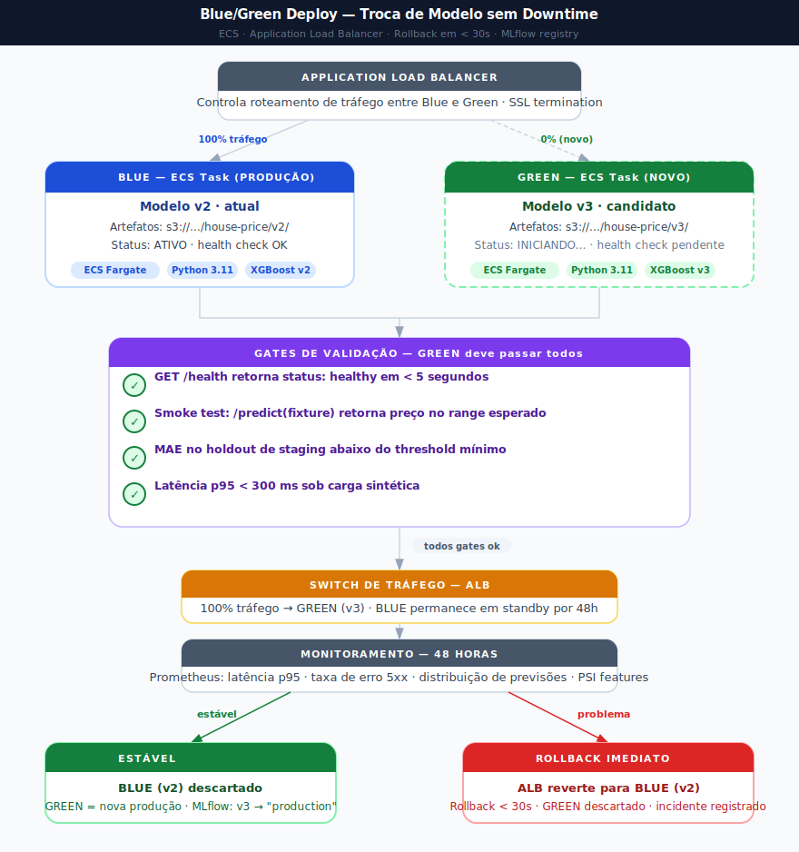

# Aprendizado Contínuo

---

## 1. Por Que Reentreinar?

O modelo atual foi treinado com dados de transações imobiliárias de King County de maio/2014 a maio/2015. Isso é suficiente para demonstrar a solução, mas em um contexto de uso real, dois problemas surgem com o tempo:

**Drift de dados (data drift):** a distribuição das features de entrada muda. Imóveis sendo construídos são maiores, têm grades mais altas, os zipcodes valorizados mudam. Se as características dos imóveis que chegam na inferência divergem das que o modelo viu no treino, a performance degrada.

**Drift de conceito (concept drift):** a relação entre features e preço muda. Um grade 8 que valia US$ 700k em 2015 pode valer US$ 1,2M em 2024. O modelo não aprende essa mudança — ele continua prevendo com base nos padrões antigos.

A diferença prática: data drift pode ser detectado sem o preço real (comparando distribuições de entrada); concept drift só pode ser detectado quando o preço de venda real está disponível para comparação.

---

## 2. Coleta de Novos Dados

### 2.1 Fonte principal

O dataset KC House Sales é público e pode ser atualizado periodicamente com dados do King County Assessor. O script `scripts/download_kc_house_data.py` já lida com o download — a evolução natural seria adicionar lógica incremental (baixar apenas transações após a última data conhecida).

### 2.2 Ground truth para monitoramento

O desafio central no mercado imobiliário é que o "preço real" de um imóvel só é conhecido quando ele é vendido. Para fechar o loop de aprendizado:

1. Usuário consulta o sistema para um imóvel
2. O sistema registra: features de entrada, previsão, timestamp, ID da sessão
3. Quando a venda ocorre, o preço realizado pode ser associado ao registro de predição
4. Compara-se `predicted_price` com `actual_price` → erro real em produção

Em produção real, essa associação pode ser feita manualmente (integração com sistema de CRM imobiliário) ou por matching automático via zipcode + características físicas.

---

## 3. Detecção de Drift

### 3.1 Data drift (sem precisar do target)

Monitorar a distribuição das features de entrada nos últimos N dias e comparar com a distribuição do conjunto de treino:

**PSI (Population Stability Index):** métrica padrão de drift para features numéricas.
- PSI < 0.1: sem drift significativo
- PSI 0.1–0.2: drift moderado — monitorar
- PSI > 0.2: drift expressivo — considerar reentreino

Features prioritárias para monitorar: `grade`, `sqft_living`, `zipcode` (frequência por categoria), `lat`/`long`.

**KS-test:** para features contínuas, o teste Kolmogorov-Smirnov detecta se a distribuição de entrada atual é estatisticamente diferente da distribuição de treino.

### 3.2 Concept drift (requer target)

Quando preços reais de venda estiverem disponíveis, calcular as métricas de produção em janela deslizante:

```
MAPE_produção(últimos_30_dias) vs MAPE_referência(conjunto_de_teste)
```

Se `MAPE_produção > MAPE_referência + 5pp`, o modelo está degradado.

---

## 4. Gatilhos para Reentreino

O reentreino não precisa ser agendado em calendário fixo. Gatilhos baseados em evidência são mais eficientes:

| Gatilho | Threshold | Ação |
|---|---|---|
| PSI médio das top-5 features | > 0.2 | Investigar drift; considerar reentreino |
| MAPE em produção | > MAPE_referência + 5pp | Reentreinar com dados recentes |
| Acúmulo de novos dados com target | ≥ 5.000 novas transações | Reentreino programado |
| Mudança macroeconômica relevante | Taxa de juros ±2pp ou crise | Reentreino emergencial com ajuste manual de threshold |

---

## 5. Pipeline de Reentreino



> Fonte editável: [`diagrams/03-retraining-pipeline.excalidraw`](diagrams/03-retraining-pipeline.excalidraw)

**Full retrain vs windowed retrain:**

- **Full retrain** (todos os dados históricos + novos): preferível quando há poucos dados novos ou o mercado é estável. Melhor generalização, treino mais lento.
- **Windowed retrain** (apenas últimos N meses): preferível quando há drift de conceito expressivo e dados antigos "confundem" o modelo. Mais rápido, pode perder padrões de longo prazo.

Na prática, testar as duas abordagens no holdout e escolher a que performa melhor.

---

## 6. Critérios de Promoção

Um novo modelo só substitui o modelo em produção se passar em todos os critérios:

| Critério | Condição |
|---|---|
| R² no holdout | ≥ R² do modelo atual |
| MAE no holdout | ≤ MAE do modelo atual + 5% |
| MAPE no holdout | ≤ MAPE do modelo atual + 2pp |
| Cobertura P10–P90 | ≥ 75% |
| Sem degradação em subgrupos | Verificar waterfront, grade 10+, alto valor (> $1M) separadamente |

O critério de subgrupos é importante: um modelo pode melhorar a métrica global mas degradar em segmentos específicos. Verificar performance por faixa de preço e por zipcode evita regressões pontuais.

---

## 7. Substituição Segura em Produção

O processo de promoção deve ser feito com controles para evitar interrupção do serviço:

### Abordagem recomendada (blue-green)



> Fonte editável: [`diagrams/04-bluegreen-deploy.excalidraw`](diagrams/04-bluegreen-deploy.excalidraw)

Na arquitetura atual (Railway), o switch é feito via novo deploy da imagem Docker. O rollback é viável via Railway Deployments (reverter para build anterior).

### Validação manual antes do switch

Antes de qualquer promoção, validar manualmente em N imóveis conhecidos:
- Imóvel de referência em cada faixa de preço
- Imóvel waterfront
- Imóvel de grade alto (≥ 10)
- Imóvel em zipcode de alta demanda e baixa demanda

Se as previsões do novo modelo para esses casos parecerem razoáveis e dentro do esperado, o switch é seguro.

---

## 8. Monitoramento Contínuo Pós-Promoção

Após a promoção de um novo modelo, manter monitoramento ativo por 30 dias:

**Métricas a acompanhar:**
- Distribuição diária das previsões (previne modelos que "travam" em um valor)
- Taxa de predições fora do range histórico (< $50k ou > $5M são sinais de problema)
- Latência do endpoint `/predict` (regressão de performance computacional)
- Erros de validação de payload (mudanças não intencionais na interface esperada)

**Frequência:**
- Diária: verificação rápida de distribuição e erros
- Semanal: análise de PSI para features de entrada
- Mensal: análise completa de MAPE se ground truth disponível

---

## 9. Riscos e Controles

| Risco | Probabilidade | Impacto | Controle |
|---|---|---|---|
| Novo modelo com performance inferior | Média | Alto | Critérios rígidos de promoção; comparação em subgrupos |
| Vazamento de dados no reentreino (data leakage) | Média | Alto | Split temporal estrito; verificar features derivadas de datas |
| Drift não detectado por falta de ground truth | Alta | Médio | Monitoramento de data drift não requer target |
| Instabilidade de hiperparâmetros em novos dados | Baixa | Médio | Usar os mesmos parâmetros + early stopping; tuning só se necessário |
| Sazonalidade mal representada | Média | Baixo | Garantir que o período de reentreino inclua todos os meses do ano |

---

*Diagramas: [`docs/diagrams/`](diagrams/)*
